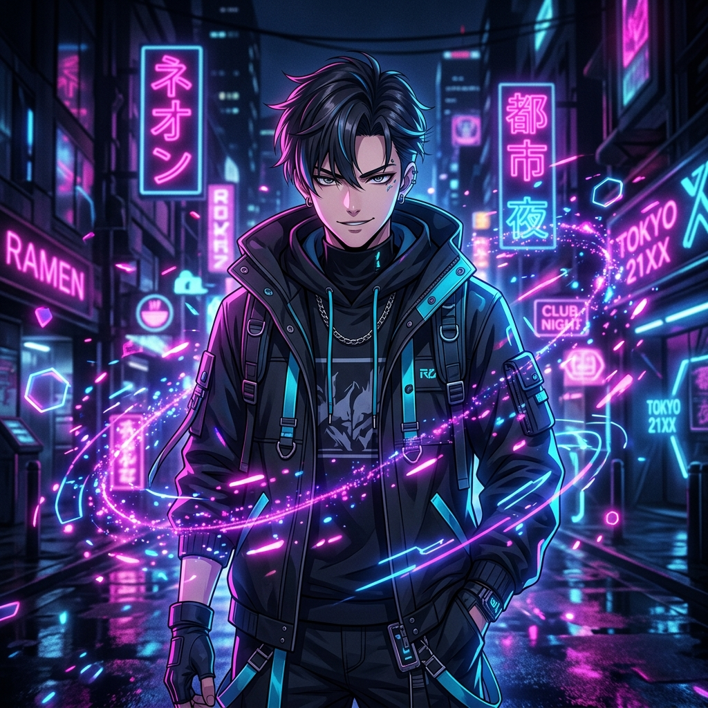

<!-- ╔══════════════════════════════════════════════════════════════════╗ -->
<!-- ║  r-json — GitHub Profile README                                ║ -->
<!-- ║  Anime / Neon Vibe Redesign                                    ║ -->
<!-- ╚══════════════════════════════════════════════════════════════════╝ -->

<!-- ANIMATED NEON GRADIENT HEADER -->

<!-- TYPING ANIMATION (M PLUS Rounded 1c Font) -->

 

<!-- SOCIAL BADGES (Pink Accents) -->

 

Hi 👋, I am **Arjay**, an enthusiastic and ambitious full stack developer based in the Philippines. I specialize in Web Development, Applied AI, and Blockchain. I love to network, join new communities and add value ✨

 

<!-- ── STATS & PORTRAIT (SPLIT LAYOUT) ─────────────────────────────── -->

<table>
  <tr>
    <td width="55%" valign="top">
      <h3>🔥 GitHub Stats</h3>
      
        
      
    </td>
    <td width="45%" valign="top" align="center">
      <!-- GENERATED ANIME PORTRAIT -->
      
    </td>
  </tr>
</table>

 

<!-- ── TOP PROJECTS (CARDS) ────────────────────────────────────────── -->

### 📁 My Top Projects

<table>
  <tr>
    <td width="50%" valign="top">
      
    </td>
    <td width="50%" valign="top">
      
    </td>
  </tr>
  <tr>
    <td width="50%" valign="top">
      
    </td>
    <td width="50%" valign="top">
      
    </td>
  </tr>
</table>

 

<!-- ── TECH STACK (SKILLICONS) ─────────────────────────────────────── -->

### 💻 Tech Stack

  

 

<!-- ── CONTRIBUTION GRAPH ──────────────────────────────────────────── -->

### 🎮 Contribution Graph

  

 
